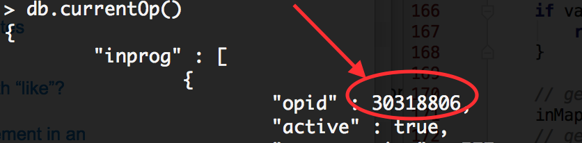

# 6.6.-Troubleshooting
## 1.
Для просмотра всех активных подключений

    db.currentOp()(данная команда предоставляет информацию обо всех активных соединениях)

        db.killOp(30318806)
Чтоб в будущем не было таких проблем, необходимо перестроить соответствующий индекс.
## 2.
Предпологаю, что проблема связана с исчерпанием ресурсов оперативной памяти   
## 3.
Для исправления данной проблемы могут пригодиться разные варианты, вплоть что файлы БД биты, не хватает оперативной памяти и поврежден жесткий диск или файлы ОС. Так же проблема может быть из-за сетевых разрывов. Необходимо более детально определять слабое место. 
Установив очень низкий WAIT_TIMEOUT для своего сервера MySQL мы можем столкнуться с данной проблемой.
Но необходимо посмотреть основные значнения тайм-аута к примеру вот запрос сделаный мной в моей БД в докере

    mysql> SHOW SESSION VARIABLES LIKE 'wait_timeout';
    +---------------+-------+
    | Variable_name | Value |
    +---------------+-------+
    | wait_timeout  | 28800 |
    +---------------+-------+
    1 row in set (0.00 sec)

    SHOW SESSION VARIABLES LIKE 'connect_timeout';
    +-----------------+-------+
    | Variable_name   | Value |
    +-----------------+-------+
    | connect_timeout | 10    |
    +-----------------+-------+
    1 row in set (0.00 sec)

    SHOW SESSION VARIABLES LIKE 'interactive_timeout';
    +---------------------+-------+
    | Variable_name       | Value |
    +---------------------+-------+
    | interactive_timeout | 28800 |
    +---------------------+-------+
    1 row in set (0.00 sec)

Так же стоит обратить внимания max_connections=2048 по умолчанию  установлен. Необходимо проверить. 
## 4.
Выполнить команду

    free -h

               total        used        free      shared  buff/cache   available
        Mem:           7.7Gi       5.3Gi       928Mi       865Mi       1.5Gi       1.3Gi
        Swap:          9.4Gi       7.1Gi       2.2Gi

В основном эта ошибка связана с тем, что процесс либо завершен OUT-OF-Memory killer. Для того, чтоб киллер не убивал процесс можно задать системе командой 

        sudo echo -100 > /proc/3813/oom_score_adj
Важность данного процесса. 
Так же установите значение

    [Service]
    OOMScoreAdjust=-1000
Так же можнго отключить OOM-Killer

    sudo -s sysctl -w vm.oom-kill = 0
и для закрепления эффекта необходимо

    echo vm.oom-kill = 1 >>/etc/sysctl.conf

Linux может зарезервировать для процессов больше памяти, чем есть, но не выделять ее по факту, и этим поведением управляет параметр ядра Linux. За это отвечает переменная vm.overcommit_memory.